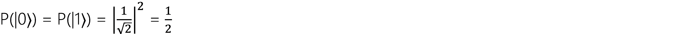
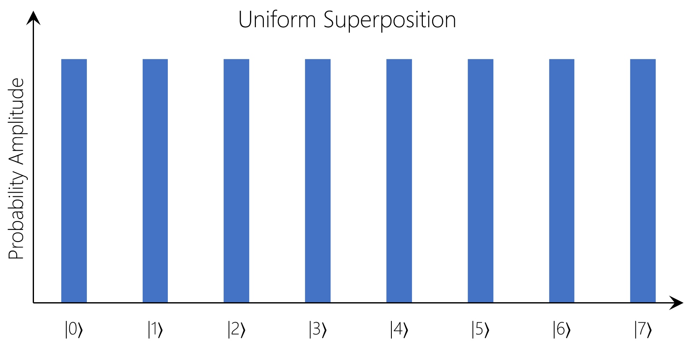
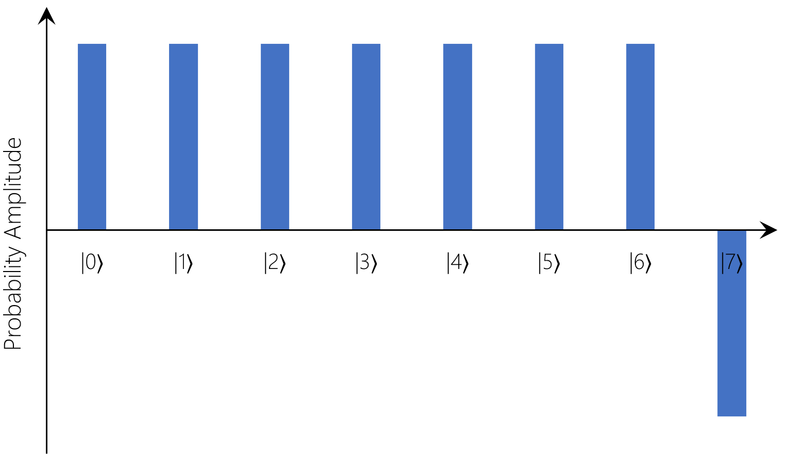
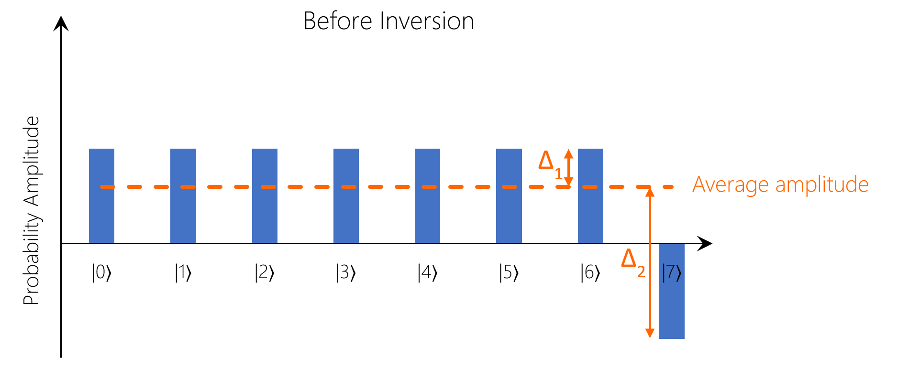
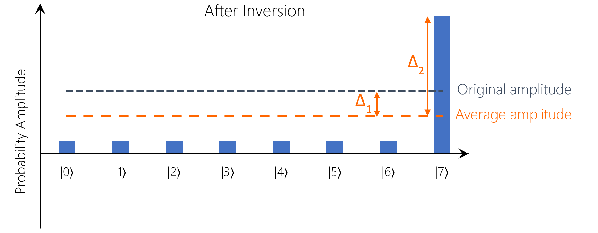
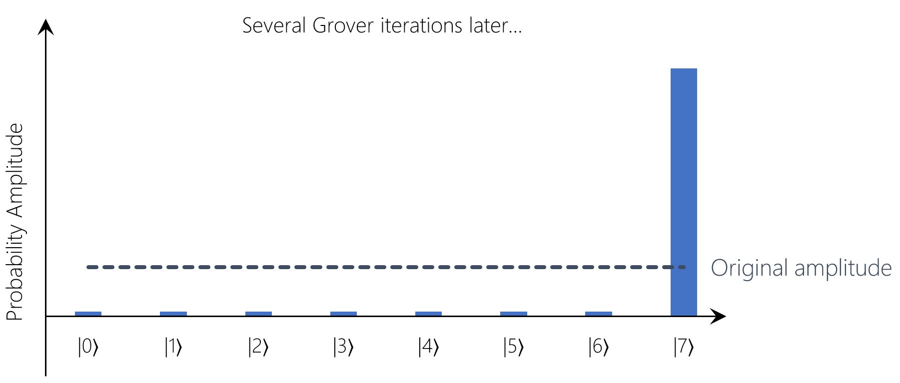

# Grover's Algorithm

> The festive version of this post can be found [here](./GroversBlog_Festive.md).

If you’ve been reading into quantum computing you’ve probably come across something called [Grover’s algorithm](https://en.wikipedia.org/wiki/Grover's_algorithm). Grover’s algorithm is famously applied to the search of an unordered database but it is applicable across a wide range of problems (such as [nearest neighbour classification](https://arxiv.org/pdf/1401.2142.pdf) in machine learning, for example).

The idea is that we have a database of N randomly ordered entries and we want to find one specific entry in the database. Classically, in the best case scenario this takes us just one try (if we get really lucky and happen to pick the right one on our first attempt), or in the worst case scenario it’s the very last one we try and therefore it takes N attempts. On average, it would take us roughly N/2 attempts to find the entry we are looking for. This means that the computational complexity of the task scales linearly as N increases and is therefore O(N), in computer science-speak. 

Fortunately for us, elves are well known for their excellent grasp of quantum mechanics and so the Science and Magic Team quickly came up with an efficient solution to the problem - Gro-ho-ho-ver’s algorithm! This new technique makes use of quantum interference in order to reduce the complexity of the problem (to O(√N)). Unlike some other quantum algorithms (such as Shor’s), this is not an exponential speedup vs. the classical alternative, however it can still provide significant benefit if applied over a large enough problem space.

In this post we will explore how Grover’s algorithm works in a bit more detail by walking through a [simplified implementation](https://github.com/anraman/quantum/tree/master/GroverDatabaseSearch) in Q#, based on [this sample](https://github.com/Microsoft/Quantum/tree/release/v0.3.1810/Samples/src/DatabaseSearch) provided by the [Microsoft Quantum team on GitHub](https://github.com/Microsoft/Quantum) 😊

## The Scenario

First, let’s define the problem:

- **We have:** Database with N unsorted entries
- **We want to:** Find element with index *k* (0 ≤ *k* ≤ N-1) - this is our marked element
- **We need:** *n* qubits to represent this information (remember each qubit can represent two bits of information so to represent N database entries we need *n* qubits such that 2*ⁿ* ≥ N)
- **We start with:** All the qubits in our register initialised to a simple starting state, in this case all Zeroes, like so: |000…00〉

For the purposes of this blog post, we will assume that our database has eight entries, which means we will need **three** qubits (2³ = 8) in our register. We will be looking for last entry (represented by |7〉, because we start at index 0) in this example - this is our marked element.

## Step 1: Prepare States for Search

The first thing we need to do is to create an equal superposition of states using the Hadamard operator applied to each of our qubits (which all start in the Zero state).

As a reminder, the Hadamard (H) operator transforms a qubit in the |0〉 state to a qubit in the |+〉 state, which is an equal superposition of the |0〉 and |1〉 states (i.e. when you measure the superposition it collapses to |0〉 with 50% probability and |1〉 with 50% probability). This is shown below:




When we apply the Hadamard to an *n*-qubit register (H<sup>⊗*n*</sup>) initialised to the all-Zero state (|00...0〉), we get the following:


Substituting in N = 8 for our three-qubit case:


If we were to take a measurement of the register at this point, we would find our chosen qubit (|7〉) with probability ¹/<sub>N</sub> = ¹/<sub>8</sub> - this is the same situation as we have classically.

Below is a visualisation of what this looks like in terms of probability amplitudes - as you can see, currently the probability amplitudes are equal across all states in the register which means that when we take the measurement we are equally likely to see any of the qubit states |0〉 to |7〉:



In Q#, this operation looks like this:

```csharp
// Oracle that applies the Hadamard operator to each qubit in the register
// to transform starting state |00...0〉 to the uniform superposition |++...+〉 = |u〉

operation UniformSuperpositionOracle (databaseRegister : Qubit[]) : Unit {
    body (...) {
        let nQubits = Length(databaseRegister);
        for (idxQubit in 0 .. nQubits - 1) {
            H(databaseRegister[idxQubit]);
        }
    }
    adjoint invert;
}
```

We then need to mark the element we are looking for using a single [ancillary qubit](https://en.wikipedia.org/wiki/Ancilla_bit) which we will flip from state |0〉 to |1〉 if and only if the register is in the state we are looking for (in this case, |7〉 = |111〉):

```csharp
// Oracle that flips the marked qubit from |0〉 to |1〉 if and only if
// the database register is in state |N-1〉 = |11...1〉
operation DatabaseOracle (markedQubit : Qubit, databaseRegister : Qubit[]) : Unit {
    body (...) {
        // Make use of the Controlled functor to apply this operation
        Controlled X(databaseRegister, markedQubit);
    }
    adjoint invert;
}
```

Putting these steps together:

```csharp
operation StatePreparationOracle (markedQubit : Qubit, databaseRegister : Qubit[]) : Unit {
    body (...) {
        // Starting state
        // |0〉|00...0〉

        UniformSuperpositionOracle(databaseRegister);
        // |0〉|++...+〉 = 1/√N * |0〉(|0〉 + |1〉 + ... + |N-1〉)

        DatabaseOracle(markedQubit, databaseRegister);
        // |s〉 = 1/√N * |0〉(|0〉 + |1〉 + ... + |N-2〉) + 1/√N * |1〉|N-1〉
    }

    adjoint invert;
}
```

The ancillary qubit is the single qubit you see before the register qubits in the comments above, highlighted in bold below:

**|0〉**|00...0〉

**|0〉**|++...+〉 = 1/√N * **|0〉**(|0〉 + |1〉 + ... + |N-1〉)

**|0〉**(|0〉 + |1〉 + ... + |N-2〉) + 1/√N * **|1〉**|N-1〉

We can see that after the last operation (`DatabaseOracle`) the state of this marker qubit is |1〉 for the marked element (|N-1〉 = |8-1〉 = |7〉 in the register) and |0〉 for all other elements.

The term oracle is used to refer to any ‘black box’ process that is used as input to another algorithm - you can read more about quantum oracles [here](https://docs.microsoft.com/en-us/quantum/concepts/oracles?view=qsharp-preview).

## Step 2: Selectively apply phase shift to the marked element

We now need to apply some transformations that only influence the marked element. The first one is a reflection about the marked state. This has the effect of applying a phase change of -1 to the marked element only but has no effect on unmarked elements.

During this transformation, all probability amplitudes remain the same - only the phase changes (this has no effect on measurement probabilities):



As we can see from the above, only the sign (phase) of the probability amplitude for our marked element has changed because of this operation - the bars are still all the same size (they still have the same magnitude) hence the measurement probabilities have not changed

```csharp
// Apply a rotation that has the effect of applying a -1
// phase to the amplitude of the marked element only
operation ReflectMarked (markedQubit : Qubit) : Unit {
    // Marked elements always have the marked qubit in the state |1〉
    R1(PI(), markedQubit);
}
```

## Step 3: Invert about the average (reflect about the start state)

The next step - also known as the diffusion operator - influences the probability amplitudes of all the states in the register by inverting around the average. This has the effect of taking the difference from the average probability amplitude and subtracting this value from each bar:

- In the case where the difference is positive (e.g. Δ₁ below), this results in a subtraction which reduces (dampens) the probability amplitude for the state in question
- In the case where the difference is negative (i.e. Δ₂ below), this results in an addition which increases (amplifies) the probability amplitude for the state in question

This process is perhaps more easily understood through illustration:




And here’s the code:

```csharp
// Reflect about the start state
operation ReflectStart (markedQubit : Qubit, databaseRegister : Qubit[]) : Unit {
    // Perform adjoint state preparation operation to retrieve start state
    Adjoint StatePreparationOracle(markedQubit, databaseRegister);

    // Reflect about the start state (|00…0〉)
    ReflectZero([markedQubit] + databaseRegister);

    // Prepare the state |s〉 again using the oracle
    StatePreparationOracle(markedQubit, databaseRegister);
}
```

Together, steps two and three make up the ‘Grover iteration’. In order to find our marked state with probability O(1), we simply need to repeat the Grover iteration O(√N) (√8 in this case) times. This has the effect of massively amplifying the probability amplitude of the marked element and greatly dampening the probability amplitudes of all other states:



Now, when we take a measurement of the register, we are much more likely to find the marked state than any other. Of course, this is still a probabilistic measurement so there is a chance that we will measure and find a state other than the one we are looking for; however this can be mitigated by repeating the measurement a small number of times.

Putting it all together, the full algorithm is as follows:

1. Prepare states for search
2. Selectively apply phase shift to the marked element
3. Invert about the average (reflect about the start state)
4. Repeat steps 2 & 3 O(√N) times
5. Measure (there is now an O(1) probability of finding the marked state)

The code for the full quantum search looks like this:

```csharp
// Repeat the two reflection steps O(√N) times to amplify the amplitude of
// the marked state and obtain the marked element with O(1) probability
operation QuantumSearch (nIterations : Int, markedQubit : Qubit, databaseRegister : Qubit[]) : Unit {
    StatePreparationOracle(markedQubit, databaseRegister);

    // Perform Grover iterations
    for (idx in 0 .. nIterations - 1) {
        ReflectMarked(markedQubit);
        ReflectStart(markedQubit, databaseRegister);
    }
}
```

## Final Step: Try it for yourself!

All the code shown so far is available [here](https://github.com/anraman/quantum/tree/master/GroverDatabaseSearch) on GitHub - feel free to download and run the sample for yourself (instructions in the readme). The program does two things:

- First, it runs a classical search 1000 times (i.e. measuring the register in balanced superposition without performing any Grover iterations) and prints the result.
- Second, it runs the quantum search 1000 times with three Grover iterations per run and prints this result for comparison. Try modifying the number of Grover iterations to see how this affects the success rate of the search!

Once you’ve explored the code there, it’s a good idea to check out the [DatabaseSearch sample](https://github.com/Microsoft/Quantum/tree/release/v0.3.1810/Samples/src/DatabaseSearch) on the [official Microsoft Quantum GitHub](https://github.com/Microsoft/Quantum) which provides a more sophisticated implementation, as well as the fantastic [Quantum Kata for Grover’s algorithm](https://github.com/Microsoft/QuantumKatas/tree/master/GroversAlgorithm) which will really put your understanding to the test!

Don’t forget to tune in for more posts each day this month as the [Q# Advent Calendar 2018](https://blogs.msdn.microsoft.com/visualstudio/2018/11/15/q-advent-calendar-2018/) continues 😊